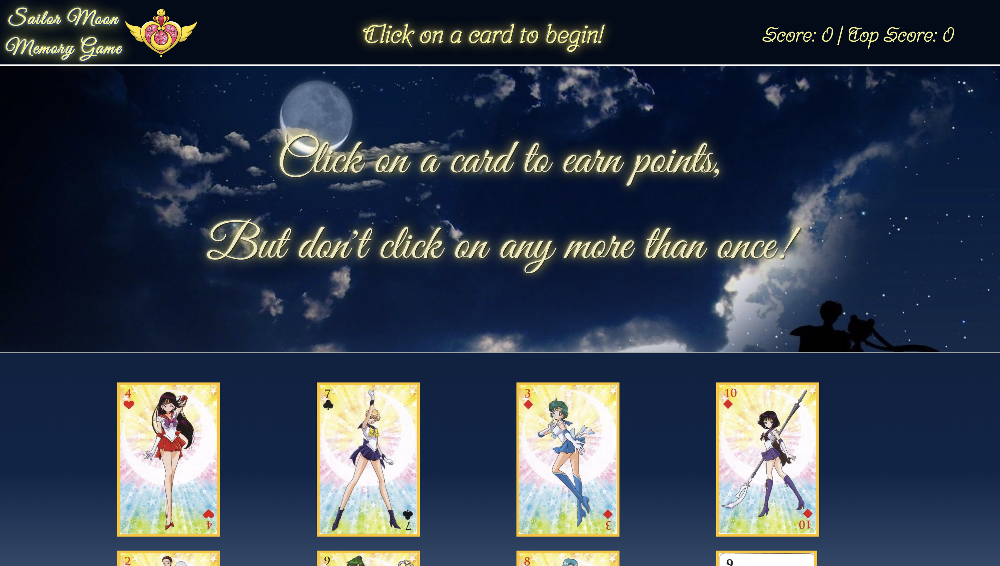

# Sailor Moon Memory Game
## (Clicky Game)

## Description
A Sailor Moon themed memory game to bring back Saturday morning cartoons nostalgia! 
Click the cards but make sure to not click the same one twice! Reach the highest possible score of 12!

## Dependencies
 * React.js
 * Bootstrap
 * JavaScript
 
## How-To
Simply clone this repository to your machine. Run npm install in your terminal. 
Once all dependences are loaded run npm start and enjoy!

## [Play on Heroku!](https://clickysailormoon.herokuapp.com/)

### Developed by Ana Lee
